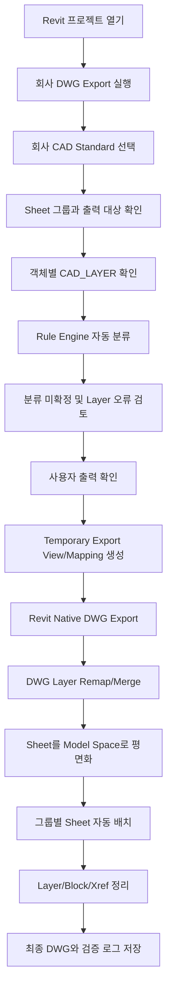
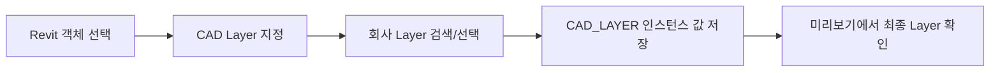

# Revit 한국형 DWG Export 애드인 개발 계획서

작성일: 2026-08-10

기준 문서: `Revit_Korean_DWG_Exporter_Codex_Spec.md`

## 1. 문서 목적

이 문서는 Revit 모델과 Sheet를 한국 설계사무소의 기존 CAD 작성 방식에 맞는 DWG로 변환하는 `Revit 한국형 DWG Export 애드인`의 개발 계획서다.

이 애드인의 핵심 목적은 단순히 Revit의 `Document.Export()`를 대신 실행하는 것이 아니다. Revit의 Category, Family, Type, Material, Structural Usage, Parameter 등 BIM 정보를 회사별 CAD Layer Standard로 번역하고, 여러 Revit Sheet를 그룹별로 묶어 하나의 DWG Model Space에 배열하는 Export 파이프라인을 만드는 것이다.

주요 대상은 다음 범위를 포함한다.

- `CAD_LAYER` 인스턴스 매개변수를 이용한 객체별 수동 레이어 지정
- Category/Family/Type/Parameter 기반 자동 레이어 분류
- 회사별 CAD Layer Standard 관리
- Revit Native DWG Export 설정과 임시 Export View 활용
- DWG Layer 이름 변경, 병합, 색상, 선종류, 선가중치 후처리
- Sheet 그룹별 단일 DWG 생성
- Sheet의 시각적 결과를 Model Space에 평면화
- 여러 Sheet의 가로, 세로, 격자 자동 배치
- 출력 전 검토, 실행 로그, 경고 및 결과 검증

본 문서는 1차 구현 방향을 공유하기 위한 통합 기획 문서로, 요구사항정의서, 기능명세서, 화면설계서, 데이터/규칙 설계서, 기술 검증 계획을 함께 포함한다.

이 프로젝트는 Revit API만으로 모든 요구사항이 확정적으로 해결된다고 가정하지 않는다. Revit Native Export가 담당할 범위와 DWG 후처리 엔진이 담당할 범위를 실제 Prototype으로 먼저 검증한 뒤 전체 제품을 확장한다.

---

## 2. 배경

Revit의 DWG Export는 기본적으로 Category/Subcategory 중심으로 레이어를 매핑한다. BIM 관점에서는 같은 Category에 속하는 요소라도 한국 설계사무소의 CAD 표준에서는 서로 다른 레이어로 구분해야 하는 경우가 많다.

대표적인 예는 다음과 같다.

- 구조 프레임의 Beam과 Girder 분리
- 벽의 콘크리트, 조적, 블록, 석고, 유리, 마감벽 분리
- 같은 Type을 사용하는 일부 인스턴스만 특수 레이어로 출력
- 서로 다른 Revit Category의 요소를 하나의 회사 CAD 레이어로 병합
- 회사마다 다른 Layer 이름, 색상, 선종류, 선가중치 적용

현재 실무에서는 이 문제를 해결하기 위해 다음과 같은 사전 작업이 반복된다.

- 패밀리 분리
- Subcategory 추가
- Object Styles 수정
- View Filter 작성
- View Template에 필터 적용
- 새 View 생성 시 출력용 그래픽 설정 재확인

이 방식은 CAD 출력을 위해 BIM 모델링 규칙과 View 관리 방식이 영향을 받는다는 문제가 있다.

또한 Revit 기본 Sheet Export는 시트별 DWG를 만들거나 Paper Space/Layout/Xref 중심으로 결과를 구성한다. 한국 설계사무소에서는 여러 도면을 하나의 DWG Model Space에 가로 또는 격자로 펼쳐 사용하는 경우가 많으므로 별도의 Sheet 평면화와 병합 과정이 필요하다.

따라서 이 애드인은 다음 원칙으로 개발한다.

```text
BIM 모델링 규칙
        ≠
회사 CAD 작성 규칙
```

Revit 모델은 BIM 논리에 맞게 유지하고, 회사 CAD 표준으로의 변환은 Export 단계에서 수행한다.

---

## 3. 목표

### 3.1 제품 목표

사용자가 Revit에서 회사 DWG 출력을 실행하면 시스템은 다음 결과물을 생성한다.

- 객체별 최종 CAD Layer 판정 결과
- `CAD_LAYER` 수동 지정값과 Rule Engine 자동 분류 결과
- 회사 CAD Layer Standard가 적용된 DWG
- Sheet 그룹별 단일 DWG
- 각 Sheet가 Model Space에 배치된 DWG
- 회사 표준 색상, 선종류, 선가중치
- 불필요한 임시 레이어와 Revit 생성 레이어가 정리된 결과
- 출력 성공, 경고, 실패 내역
- Layer 변환 및 Sheet 배치 검증 로그

최종 사용자 경험은 다음과 같이 단순하게 유지한다.

```text
일반 객체
→ 정상적으로 Revit 모델링

예외 객체
→ 객체 선택
→ CAD Layer 지정

Sheet
→ CAD_EXPORT_GROUP / CAD_EXPORT_ORDER 설정

출력
→ 회사 DWG 출력
→ 그룹별 최종 DWG 생성
```

### 3.2 1차 성공 목표

1차 구현은 모든 Revit 객체와 모든 DWG 예외를 동시에 지원하는 완제품이 아니다. 다음 세 가지 Prototype과 제한된 MVP를 성공시키는 것을 목표로 한다.

```text
Prototype A
Wall A → TEST_A
Wall B → TEST_B
→ 동일 Category의 서로 다른 인스턴스가 DWG에서 식별 가능한 그룹으로 분리

Prototype B
Wall 1 → LAYER1
Roof 1 → LAYER1
Beam 1 → LAYER2
→ 서로 다른 Category를 최종 DWG의 같은 Layer로 병합

Prototype C
A101 + A102 + A103
→ TEST_GROUP.dwg 하나의 Model Space에 가로 배열
```

### 3.3 장기 목표

- 건축, 구조, 주석, 링크, 가져오기 객체까지 지원 범위 확대
- 회사별 CAD Standard Profile 공유
- Rule Editor 고도화
- Sheet 1:1 Model Space 배치 모드 추가
- Xref/Bind 정책 선택
- 출력 비교 및 회귀검증 자동화
- 필요 시 CustomExporter 기반 독립 변환 경로 검토

---

## 4. 기본 용어

| 용어 | 설명 |
|---|---|
| CAD Layer Standard | 회사에서 사용하는 Layer 이름, 색상, 선종류, 선가중치 규칙 |
| CAD_LAYER | Revit 객체별 최종 CAD Layer를 수동 지정하는 인스턴스 공유 매개변수 |
| CAD_EXPORT_GROUP | Sheet를 어떤 최종 DWG 파일로 묶을지 지정하는 Sheet 매개변수 |
| CAD_EXPORT_ORDER | 같은 그룹 안에서 Sheet 배치 순서를 지정하는 Sheet 매개변수 |
| Rule Engine | Category, Family, Type, Parameter 조건을 평가해 Target Layer를 결정하는 기능 |
| Manual Override | `CAD_LAYER`에 사용자가 직접 입력한 값으로 자동 Rule보다 우선하는 지정 방식 |
| Native Export | Revit의 `DWGExportOptions`와 `Document.Export()`를 사용하는 기본 DWG 출력 |
| Temporary Export View | 원본 View를 변경하지 않고 출력용 Filter/Override를 적용하기 위해 만든 임시 View |
| Temporary Layer Token | Native DWG 안에서 객체 그룹을 식별하기 위한 임시 레이어 이름 |
| Post Processor | Native DWG를 읽고 Layer 변경, 병합, Sheet 평면화, 배치, 정리를 수행하는 후처리 엔진 |
| Flatten | Sheet/Layout의 보이는 결과를 Model Space의 2D Geometry로 변환하는 작업 |
| Arrange | 여러 Sheet Geometry를 가로, 세로 또는 격자로 이동 배치하는 작업 |
| Export Job | 한 번의 회사 DWG 출력 실행 단위 |
| Export Group | 같은 최종 DWG 파일에 포함되는 Sheet 묶음 |
| 기술 게이트 | 전체 개발 전에 실제 Revit/DWG에서 성공 여부를 확인해야 하는 핵심 검증 단계 |
| 검증 로그 | 분류 결과, 임시 레이어, 최종 레이어, Sheet 위치, 경고와 실패 사유를 기록한 파일 |

---

## 5. 사용자 유형

| 우선순위 | 사용자 | 주요 관심사 |
|---|---|---|
| 1 | Revit 모델링 담당자 / BIM 엔지니어 | 패밀리와 View를 CAD 출력 때문에 수정하지 않고 회사 표준 DWG를 만들고 싶다 |
| 2 | CAD 도면 담당자 | 기존 회사 Layer, 색상, 선종류, 선가중치를 그대로 유지한 DWG를 받고 싶다 |
| 3 | BIM 매니저 | 프로젝트와 View마다 반복되는 CAD 출력 설정을 표준 Profile로 관리하고 싶다 |
| 4 | 설계 검토자 | Revit Sheet와 최종 DWG의 시각적 결과가 일치하는지 확인하고 싶다 |
| 5 | 본사 전산/BIM 관리자 | 회사별 설정 배포, 버전 관리, 실패 로그, 라이선스 조건을 관리하고 싶다 |

---

## 6. 전체 사용자 흐름



객체별 수동 지정 흐름은 다음과 같다.



---

## 7. 요구사항정의서

### 7.1 핵심 요구사항

| ID | 요구사항 | 설명 | 우선순위 |
|---|---|---|---|
| REQ-001 | 독립 애드인 구성 | Revit 2026용 독립 리본과 명령으로 구성한다 | 높음 |
| REQ-002 | CAD_LAYER 공유 매개변수 | 지원 가능한 모델 카테고리에 고정 GUID의 인스턴스 공유 매개변수로 바인딩한다 | 높음 |
| REQ-003 | 선택 객체 Layer 지정 | 선택한 여러 객체에 회사 Layer 목록 중 하나를 지정한다 | 높음 |
| REQ-004 | 선택 객체 Layer 제거 | 선택한 객체의 `CAD_LAYER` 값을 비운다 | 높음 |
| REQ-005 | 객체별 값 조회 | 선택 객체의 수동 지정값, Rule 결과, 최종 Layer를 확인한다 | 높음 |
| REQ-006 | Rule 기반 자동 분류 | Category, Family Name, Type Name, Built-in/Shared Parameter를 조건으로 Target Layer를 결정한다 | 높음 |
| REQ-007 | Rule 우선순위 | 명시적인 Priority와 안정적인 동률 처리 규칙을 적용한다 | 높음 |
| REQ-008 | 기본 Operator | Equals, Contains, StartsWith, IsEmpty를 1차에 제공한다 | 높음 |
| REQ-009 | 확장 Operator | NotEquals, NotContains, EndsWith, Regex, IsNotEmpty, 수치 비교, Range를 2차에 제공한다 | 중간 |
| REQ-010 | Layer 결정 우선순위 | `CAD_LAYER` → Rule Engine → Revit 기본 Mapping 순서로 적용한다 | 높음 |
| REQ-011 | 회사 CAD Standard | Layer 이름, Color, Linetype, Lineweight를 JSON Profile로 관리한다 | 높음 |
| REQ-012 | Profile 관리 | 회사/공종/프로젝트별 Profile을 저장, 복사, 불러오기 할 수 있다 | 높음 |
| REQ-013 | Layer 유효성 검사 | 존재하지 않는 Layer, 잘못된 이름, 중복 정의, 잘못된 색상/선가중치를 출력 전에 경고한다 | 높음 |
| REQ-014 | Native Export 설정 | Revit `DWGExportOptions`와 Export Layer Table을 읽고 적용한다 | 높음 |
| REQ-015 | 임시 객체 그룹 분리 | 같은 Category의 객체를 Rule 결과에 따라 DWG에서 식별 가능한 임시 그룹으로 분리한다 | 높음 |
| REQ-016 | 임시 View 안전성 | 원본 View와 View Template을 변경하지 않고 임시 View/Filter를 생성하고 종료 시 정리한다 | 높음 |
| REQ-017 | Layer 후처리 | Temporary Layer를 회사 Target Layer로 Rename/Remap한다 | 높음 |
| REQ-018 | Layer 병합 | 서로 다른 Revit Category의 Geometry를 하나의 Target Layer로 병합한다 | 높음 |
| REQ-019 | Layer 속성 적용 | 회사 Standard의 Color, Linetype, Lineweight를 최종 Layer에 적용한다 | 높음 |
| REQ-020 | Sheet 그룹 매개변수 | Sheet에 `CAD_EXPORT_GROUP`, `CAD_EXPORT_ORDER`를 제공한다 | 높음 |
| REQ-021 | Sheet 그룹별 출력 | 같은 Group의 Sheet를 하나의 DWG로 생성한다 | 높음 |
| REQ-022 | Model Space 평면화 | 1차는 Sheet의 보이는 결과를 Model Space Geometry로 평면화한다 | 높음 |
| REQ-023 | Sheet 자동 배치 | 가로, 세로, N열 격자, 자동 격자 배치를 제공한다 | 높음 |
| REQ-024 | Sheet 정렬 | `CAD_EXPORT_ORDER`를 우선하고, 값이 없으면 Sheet Number로 정렬한다 | 높음 |
| REQ-025 | 배치 간격 | 고정 간격 또는 도곽 Bounding 범위와 Margin을 기준으로 배치한다 | 높음 |
| REQ-026 | 출력 미리보기 | Sheet 그룹, 정렬, 객체별 Layer 판정 통계를 실행 전에 확인한다 | 높음 |
| REQ-027 | 결과 로그 | Element 분류, 임시/최종 Layer, Sheet 위치, 경고와 실패 사유를 기록한다 | 높음 |
| REQ-028 | 부분 실패 처리 | 한 Sheet 실패가 가능한 경우 다른 Sheet/Group 전체를 무조건 폐기하지 않고 결과와 실패를 구분한다 | 중간 |
| REQ-029 | 기존 파일 보호 | 기존 DWG를 기본적으로 자동 덮어쓰지 않고 사용자 확인 또는 버전 파일명을 사용한다 | 높음 |
| REQ-030 | 설정 저장 | 마지막 Profile, 출력 폴더, 배치 방식 등 사용자 설정을 재사용한다 | 높음 |
| REQ-031 | 한국어 UI | 리본, 설정창, 경고, 도움말을 한국어 중심으로 제공한다 | 높음 |
| REQ-032 | Revit 기본 Mapping Fallback | 수동값과 Rule이 모두 없으면 Revit 기본 Category/Subcategory Layer Mapping을 사용한다 | 높음 |
| REQ-033 | 진단용 Prototype | 전체 UI 전에 기술 검증용 명령으로 8개 핵심 테스트를 수행한다 | 높음 |
| REQ-034 | 1:1 Model Space 모드 | View Geometry를 실제 1:1 크기로 유지하는 별도 출력 모드를 장기 기능으로 검토한다 | 낮음 |
| REQ-035 | CustomExporter 장기 검토 | Native Export와 후처리로 해결할 수 없는 경우에만 독립 Export 경로를 검토한다 | 낮음 |

### 7.2 비기능 요구사항

| ID | 요구사항 | 설명 |
|---|---|---|
| NFR-001 | 모델 독립성 | CAD 출력을 위해 Family, Subcategory, Object Styles, 원본 View를 강제로 변경하지 않는다 |
| NFR-002 | 모델 안전성 | 영구 모델 변경은 사용자가 실행한 `CAD_LAYER`와 Sheet 매개변수 입력으로 제한한다 |
| NFR-003 | 임시 데이터 정리 | 임시 View, Filter, Override, 중간 DWG는 성공/실패/취소와 관계없이 정리한다 |
| NFR-004 | 재현 가능성 | 같은 모델, 같은 View, 같은 Profile, 같은 Rule이면 같은 Layer 판정과 배치 결과가 나와야 한다 |
| NFR-005 | 설명 가능성 | 각 객체가 수동값, Rule 또는 기본 Mapping 중 무엇으로 분류됐는지 확인할 수 있어야 한다 |
| NFR-006 | 표준 분리 | 회사 CAD Standard 변경 시 Revit 모델을 수정하지 않고 Profile만 교체할 수 있어야 한다 |
| NFR-007 | 성능 | 분류는 모델 전체를 반복 순회하지 않도록 View/Sheet별 캐시와 그룹 처리를 사용한다 |
| NFR-008 | 원자적 결과 | 최종 DWG는 임시 폴더에서 검증 후 성공한 파일만 출력 폴더로 이동한다 |
| NFR-009 | 기존 파일 보호 | 실패한 출력이 기존 정상 DWG를 손상시키지 않아야 한다 |
| NFR-010 | 감사 추적 | 실행일, 모델명, Revit 버전, 애드인 버전, Profile, Rule 버전을 기록한다 |
| NFR-011 | 오프라인 실행 | 기본 Export는 외부 서버나 클라우드 연결 없이 실행 가능해야 한다 |
| NFR-012 | 배포 가능성 | DWG SDK와 런타임의 라이선스 및 재배포 조건이 명확한 경우에만 설치본에 포함한다 |
| NFR-013 | 시각적 충실도 | Sheet 평면화 후 Text, Dimension, Hatch, Clip, Draw Order의 주요 외형이 원본과 비교 가능해야 한다 |
| NFR-014 | 버전 고정성 | Revit 2026과 선택한 DWG 후처리 SDK 버전을 명시하고 혼합 로딩을 방지한다 |
| NFR-015 | 국제 문자 | 한글 Layer, Text, Font가 손상되지 않도록 Unicode와 폰트 매핑을 검증한다 |

---

## 8. 기능명세서

### 8.1 공유 매개변수 준비

#### 목적

객체별 Layer Override와 Sheet 그룹 정보를 Revit 프로젝트에 안정적으로 저장한다.

#### 기본 방향

- 고정 GUID를 가진 공유 매개변수를 사용한다.
- `CAD_LAYER`는 가능한 모델 카테고리에 Instance Binding한다.
- `CAD_EXPORT_GROUP`, `CAD_EXPORT_ORDER`는 Sheets Category에 Binding한다.
- 사용자의 기존 Shared Parameter 파일을 덮어쓰지 않는다.
- 매개변수 생성 중 임시 Shared Parameter 파일을 사용한 경우 기존 경로를 반드시 복구한다.
- Category별 Binding 가능 여부를 사전 검사하고 불가능한 Category는 명확히 표시한다.

#### 1차 매개변수

| 매개변수 | 형식 | Binding | 설명 |
|---|---|---|---|
| CAD_LAYER | Text | Model Category Instance | 객체별 최종 Layer 수동 지정 |
| CAD_EXPORT_GROUP | Text | Sheet Instance | 최종 DWG 그룹 이름 |
| CAD_EXPORT_ORDER | Integer | Sheet Instance | 그룹 안 배치 순서 |

### 8.2 CAD Layer 지정/제거

#### 목적

같은 Type을 사용하는 객체라도 인스턴스별로 서로 다른 최종 CAD Layer를 지정한다.

#### 주요 UI

- 선택 객체 수
- 현재 값 요약
- 회사 Layer 검색
- Layer 이름, Color, Linetype, Lineweight 미리보기
- 선택 Layer 적용
- 값 제거
- 읽기 전용/미지원 객체 목록

#### 처리 규칙

- Shared Parameter 이름 문자열보다 고정 GUID 기반 접근을 우선한다.
- 하나의 Transaction으로 적용해 Revit Undo가 한 번에 동작하도록 한다.
- Group, Link 내부, 읽기 전용 객체 등 수정할 수 없는 항목은 건너뛰고 사유를 표시한다.
- 빈 값은 Manual Override가 없는 상태로 해석한다.

### 8.3 회사 CAD Layer Standard 관리

#### 목적

Layer 속성을 Revit 객체에 중복 저장하지 않고 외부 Profile에서 관리한다.

#### 기본 구조

```json
{
  "profileName": "Company_A_Architecture",
  "schemaVersion": 1,
  "layers": [
    {
      "name": "A-WALL-BRICK",
      "colorIndex": 1,
      "linetype": "Continuous",
      "lineweightMm": 0.18,
      "plot": true
    }
  ]
}
```

#### 검증 항목

- Layer 이름 공백/금지문자/중복
- ACI Color 범위
- 지원되지 않는 선가중치
- Linetype 존재 여부와 대체값
- 대소문자만 다른 중복 Layer
- Rule이 참조하지만 Profile에 없는 Layer

### 8.4 Rule Engine

#### 목적

수동 지정하지 않은 요소를 BIM 정보로 자동 분류한다.

#### 1차 조건

- Category
- Family Name
- Type Name
- Built-in Parameter
- Shared/Project Parameter

#### 1차 Operator

- Equals
- Contains
- StartsWith
- IsEmpty

#### 2차 Operator

- NotEquals
- NotContains
- EndsWith
- Regex
- IsNotEmpty
- GreaterThan
- LessThan
- Range

#### Rule 평가 결과

| 결과 | 설명 |
|---|---|
| ManualOverride | `CAD_LAYER` 값 사용 |
| RuleMatch | 가장 높은 우선순위 Rule 사용 |
| DefaultMapping | Revit Category/Subcategory Mapping 사용 |
| InvalidTarget | Rule/수동값의 Target Layer가 Profile에 없음 |
| Unsupported | 요소 또는 Parameter를 평가할 수 없음 |

### 8.5 Layer 결정 미리보기

#### 목적

DWG 생성 전에 분류 오류와 누락을 확인한다.

#### 표시 항목

- Revit Element ID
- Category
- Family/Type
- CAD_LAYER 값
- 매칭 Rule
- 최종 Target Layer
- 분류 근거
- 경고
- Sheet/View별 요소 수
- Target Layer별 요소 수

대형 모델에서는 전체 객체 행을 처음부터 모두 표시하지 않고 요약 통계와 경고 항목을 먼저 표시한다.

### 8.6 Native DWG Export

#### 목적

Revit이 안정적으로 처리하는 Geometry, Text, Dimension, Hatch, Annotation 변환을 최대한 활용한다.

#### 기본 방향

- `DWGExportOptions.GetPredefinedOptions()`로 프로젝트의 기존 Export Setup을 불러올 수 있게 한다.
- `GetExportLayerTable()`과 `SetExportLayerTable()`을 통해 Category/Subcategory 기본 Layer Mapping을 제어한다.
- Native Layer Modifier로 해결 가능한 Structural Usage, Material Type, Function 등은 우선 활용한다.
- 객체별 사용자 Rule이 필요한 부분은 임시 그룹 분리 또는 후처리로 넘긴다.
- Native Export가 만든 DWG를 최종 결과로 바로 배포하지 않고 후처리 입력으로 사용한다.

### 8.7 Temporary Export View/Mapping

#### 목적

같은 Category 안의 서로 다른 객체 분류 결과를 Native DWG에서 구별할 수 있게 한다.

#### 우선 검토 경로

```text
경로 A
Temporary View 복제
→ Parameter Filter/Graphic Override
→ PropOverrides = NewLayer
→ 하나의 Native DWG에서 임시 Layer 분리

경로 B
경로 A가 불안정한 경우
→ Target Layer 그룹별 임시 View/가시성 분리
→ 그룹별 Native DWG 생성
→ 후처리에서 하나의 DWG로 병합

경로 C
Native Export로 식별이 불가능한 범위
→ 장기적으로 CustomExporter 검토
```

경로 A의 성공 여부를 코딩 전에 확정하지 않는다. 동일 Category의 인스턴스별 Override가 실제 DWG Layer로 안정적으로 분리되는지를 기술 게이트에서 확인한다.

#### 임시 이름 규칙 예시

```text
CBM_<JobId>_<GroupIndex>
CBM_20260810_0001
CBM_20260810_0002
```

임시 이름과 최종 Target Layer의 관계는 Export Manifest에 기록한다.

### 8.8 DWG Layer 후처리

#### 목적

Native DWG의 임시 그룹을 회사 CAD Layer Standard로 변환한다.

#### 주요 기능

- DWG 읽기/쓰기
- Layer Table 조회
- Temporary Layer → Target Layer 변경
- 다른 Category에서 온 Entity를 같은 Layer로 병합
- ByLayer/ByEntity Color 정책 정리
- Linetype 로드와 적용
- Lineweight 적용
- 빈 임시 Layer 제거
- 불필요 Block/Xref/Named Object 정리
- 최종 파일 저장

#### 후처리 엔진 후보

| 후보 | 장점 | 위험/제약 | 판단 시점 |
|---|---|---|---|
| RealDWG | Autodesk 원본 DWG 기술, .NET/C++ Read/Write | 별도 라이선스, SDK/런타임/배포 조건 확인 필요 | 기술 게이트 2 |
| AutoCAD .NET/ObjectARX | AutoCAD 환경에서 강력한 DWG 처리 | 사용자 PC의 AutoCAD 의존성, Revit 단독 배포 어려움 | 사내 환경 대안 |
| 기타 상용 SDK | Revit 단독 배포 가능성 | 호환성, 비용, Text/Hatch/Dimension 품질 검증 필요 | RealDWG 대안 |

DWG 후처리 엔진이 확정되기 전에는 제품 설치 구조와 전체 일정을 확정하지 않는다.

### 8.9 Sheet 그룹 설정

#### 목적

여러 Sheet를 목적별로 하나의 최종 DWG에 묶는다.

#### 주요 UI

- Sheet Number
- Sheet Name
- CAD_EXPORT_GROUP
- CAD_EXPORT_ORDER
- 포함 여부
- 출력 파일명 미리보기
- 그룹별 Sheet 수

#### 기본 규칙

- Group이 비어 있는 Sheet의 처리 방식은 `제외` 또는 `개별 DWG` 중 Profile에서 선택한다.
- 같은 Group 안에서는 `CAD_EXPORT_ORDER` 오름차순을 우선한다.
- Order가 같거나 비어 있으면 Sheet Number 자연 정렬을 사용한다.
- 파일명 금지문자와 중복 Group 이름을 정리한다.

### 8.10 Sheet 평면화

#### 목적

Revit Sheet의 보이는 결과를 Model Space Geometry로 변환한다.

#### 1차 방식

```text
Revit Sheet Native Export
→ Paper Space/Layout 구조 조사
→ 보이는 객체를 Model Space로 변환
→ Sheet별 기준점과 외곽 범위 계산
```

1차는 시각적 결과 보존 방식을 사용한다. 한 Sheet 안에 서로 다른 축척 View가 있어도 Sheet에서 보이는 크기와 배치를 유지한다.

#### 별도 검증 대상

- Viewport Clip
- Text와 한글 폰트
- Dimension
- Filled Region/Hatch
- Detail Item
- Tag와 Symbol
- Draw Order
- Xref/Block
- 같은 모델 객체가 여러 Viewport에 보이는 경우

### 8.11 Sheet 자동 배치

#### 배치 방식

- 가로 일렬
- 세로 일렬
- 사용자 지정 N열 격자
- 도곽 크기 기준 자동 격자

#### 배치 기준

- Sheet Geometry Bounding 범위
- 사용자 Margin
- 그룹 원점
- 정렬 순서
- 각 Sheet의 Transform

Sheet별 Transform과 최종 Bounding 범위는 로그에 기록한다.

### 8.12 결과 정리와 저장

#### 처리 순서

```text
Staging 폴더에 중간 DWG 생성
→ 후처리
→ Layer/Entity/Model Space 검증
→ 성공 시 최종 출력 폴더로 이동
→ 실패 시 중간 파일과 로그 보존 여부 선택
```

#### 최종 폴더 예시

```text
DWG/
├─ 01_평면도.dwg
├─ 02_입면단면도.dwg
├─ 03_상세도.dwg
├─ 04_구조도.dwg
└─ _ExportLogs/
   ├─ ExportManifest.json
   ├─ LayerAssignments.csv
   ├─ SheetPlacements.csv
   └─ Warnings.txt
```

---

## 9. 화면설계서

### 9.1 리본 메뉴

```text
한국형 DWG Export
├─ CAD Layer 지정
├─ CAD Layer 제거
├─ Layer/Rule 관리
├─ Sheet 그룹 관리
├─ 회사 DWG 출력
└─ 기술 진단
```

### 9.2 CAD Layer 지정 창

- 선택 객체 수
- 공통 현재값 또는 혼합값 표시
- Layer 검색
- Layer 속성 미리보기
- 적용/제거
- 적용 성공, 실패, 미지원 수 표시

### 9.3 Layer/Rule 관리 창

- Profile 선택/복사/저장
- Layer 목록 편집
- Rule 목록과 Priority 변경
- Rule 활성/비활성
- 샘플 요소에 Rule 시험 적용
- 누락 Layer/중복 Rule 검증

### 9.4 Sheet 그룹 관리 창

- Sheet 표
- 그룹 일괄 지정
- Order 자동 번호
- Group 필터
- 최종 파일명 미리보기

### 9.5 회사 DWG 출력 창

- Export Setup
- 회사 Profile
- 대상 Sheet Group
- 배치 방식/열 수/Margin
- 출력 폴더
- 기존 파일 처리 방식
- 분류 미리보기
- 예상 중간 DWG 수
- 예상 최종 DWG 수
- 실행

### 9.6 실행 진행 상태 창

- 현재 Group/Sheet
- 분류 진행률
- Native Export 진행 상태
- 후처리 진행 상태
- 완료/경고/실패 수
- 취소 요청

### 9.7 완료 및 확인 필요 창

- 생성된 최종 DWG 목록
- 출력 폴더 열기
- Group별 성공/경고/실패
- 미분류 요소 수
- 누락 Layer 수
- 평면화 경고
- 로그 열기

---

## 10. 데이터 설계 초안

### 10.1 주요 엔티티

| 엔티티 | 설명 |
|---|---|
| DwgExportSettings | 사용자 출력 설정 |
| CadStandardProfile | 회사 CAD Standard Profile |
| CadLayerDefinition | Layer 이름과 속성 정의 |
| DwgRule | 자동 분류 Rule |
| RuleCondition | Rule의 Category/Parameter 조건 |
| ElementLayerAssignment | Revit 요소별 Layer 판정 결과 |
| ExportJob | 한 번의 전체 출력 실행 |
| ExportGroup | 하나의 최종 DWG로 묶이는 Sheet 그룹 |
| ExportSheet | 그룹에 포함된 Sheet 정보 |
| TemporaryLayerMap | 임시 Layer Token과 Target Layer의 관계 |
| NativeExportArtifact | Native Export 중간 DWG 정보 |
| DwgProcessingResult | 후처리 결과 |
| SheetPlacement | Sheet별 Model Space Transform과 범위 |
| ExportValidationIssue | 경고/오류/확인 필요 항목 |
| ExportManifest | 전체 실행 이력과 파일/설정/버전 정보 |

### 10.2 CadLayerDefinition 예시 필드

| 필드 | 설명 |
|---|---|
| name | 최종 Layer 이름 |
| color_index | ACI Color |
| true_color | 선택적 True Color |
| linetype | 선종류 이름 |
| lineweight_mm | 선가중치 |
| plot | Plot 여부 |
| description | Layer 설명 |
| enabled | 사용 여부 |

### 10.3 DwgRule 예시 필드

| 필드 | 설명 |
|---|---|
| rule_id | 고정 Rule ID |
| name | Rule 이름 |
| priority | 평가 우선순위 |
| enabled | 사용 여부 |
| category | Revit Category |
| parameter_key | Built-in ID, GUID 또는 이름 |
| parameter_scope | Instance/Type/BuiltIn/Shared 구분 |
| operator | 비교 방식 |
| compare_value | 비교값 |
| target_layer | 최종 CAD Layer |
| stop_on_match | 매칭 후 평가 종료 여부 |

### 10.4 ElementLayerAssignment 예시 필드

| 필드 | 설명 |
|---|---|
| document_key | 모델 식별 키 |
| element_id | Revit Element ID |
| unique_id | Revit UniqueId |
| category | Category |
| family_name | Family Name |
| type_name | Type Name |
| manual_layer | CAD_LAYER 값 |
| matched_rule_id | 매칭 Rule |
| decision_source | Manual/Rule/Default |
| target_layer | 최종 Layer |
| temporary_token | Native DWG 임시 그룹 이름 |
| warning | 분류 경고 |

### 10.5 ExportSheet 예시 필드

| 필드 | 설명 |
|---|---|
| sheet_id | Revit Sheet Element ID |
| sheet_number | Sheet Number |
| sheet_name | Sheet Name |
| export_group | CAD_EXPORT_GROUP |
| export_order | CAD_EXPORT_ORDER |
| source_view_ids | 배치된 View ID 목록 |
| native_dwg_path | Native Export 결과 경로 |
| flatten_status | 평면화 상태 |
| width | 평면화 후 폭 |
| height | 평면화 후 높이 |

### 10.6 SheetPlacement 예시 필드

| 필드 | 설명 |
|---|---|
| export_group | 그룹 이름 |
| sheet_number | Sheet Number |
| order | 배치 순서 |
| row | 격자 행 |
| column | 격자 열 |
| translate_x | X 이동량 |
| translate_y | Y 이동량 |
| scale | 적용 Scale |
| min_x/min_y | 최종 최소점 |
| max_x/max_y | 최종 최대점 |

### 10.7 ExportManifest 예시 필드

| 필드 | 설명 |
|---|---|
| job_id | 출력 실행 ID |
| executed_at | 실행일시 |
| model_path | 모델 경로 또는 중앙모델 식별값 |
| revit_version | Revit 버전 |
| addin_version | 애드인 버전 |
| cad_profile | 회사 Profile 이름/버전 |
| rule_set_version | Rule 버전 |
| post_processor | 후처리 엔진과 버전 |
| group_count | 그룹 수 |
| sheet_count | Sheet 수 |
| result_files | 최종 DWG 목록 |
| warning_count | 경고 수 |
| error_count | 오류 수 |

---

## 11. API/모듈 설계 초안

### 11.1 프로젝트 구조

```text
RevitKoreanDwgExporter
│
├─ App
│  ├─ App.cs
│  └─ RibbonBuilder.cs
│
├─ Commands
│  ├─ AssignCadLayerCommand.cs
│  ├─ ClearCadLayerCommand.cs
│  ├─ ManageCadLayersCommand.cs
│  ├─ ManageSheetGroupsCommand.cs
│  ├─ ExportCompanyDwgCommand.cs
│  └─ DwgPrototypeDiagnosticsCommand.cs
│
├─ Parameters
│  ├─ SharedParameterService.cs
│  ├─ CadLayerParameterService.cs
│  └─ SheetExportParameterService.cs
│
├─ Rules
│  ├─ DwgRule.cs
│  ├─ RuleCondition.cs
│  ├─ RuleEngine.cs
│  ├─ ParameterValueReader.cs
│  └─ ElementClassificationService.cs
│
├─ Standards
│  ├─ CadStandardProfile.cs
│  ├─ CadLayerDefinition.cs
│  ├─ JsonCadStandardRepository.cs
│  └─ CadStandardValidator.cs
│
├─ RevitExport
│  ├─ RevitDwgExportService.cs
│  ├─ ExportLayerTableService.cs
│  ├─ TemporaryExportViewService.cs
│  ├─ TemporaryLayerTokenService.cs
│  ├─ SheetExportService.cs
│  └─ TemporaryArtifactCleanupService.cs
│
├─ DwgProcessing
│  ├─ IDwgProcessor.cs
│  ├─ DwgLayerRemapper.cs
│  ├─ DwgLayerMerger.cs
│  ├─ DwgSheetFlattener.cs
│  ├─ DwgSheetArranger.cs
│  ├─ DwgCleaner.cs
│  └─ DwgValidator.cs
│
├─ Export
│  ├─ ExportJobService.cs
│  ├─ ExportManifestWriter.cs
│  ├─ ExportStagingService.cs
│  └─ ExportResult.cs
│
├─ UI
│  ├─ LayerAssignForm.cs
│  ├─ LayerRuleManagerForm.cs
│  ├─ SheetGroupManagerForm.cs
│  ├─ ExportSettingsForm.cs
│  ├─ ExportProgressForm.cs
│  └─ ExportResultForm.cs
│
└─ Models
   ├─ ExportJob.cs
   ├─ ExportGroup.cs
   ├─ ExportSheet.cs
   ├─ ElementLayerAssignment.cs
   ├─ TemporaryLayerMap.cs
   ├─ SheetPlacement.cs
   └─ ExportValidationIssue.cs
```

### 11.2 Revit API 사용 방향

| 기능 | API/방향 |
|---|---|
| DWG Export | `Document.Export()` + `DWGExportOptions` |
| 기존 Export Setup | `DWGExportOptions.GetPredefinedOptions()` |
| Layer Table | `GetExportLayerTable()` / `SetExportLayerTable()` |
| 그래픽 Override 출력 | `PropOverrides`와 `PropOverrideMode` Prototype 검증 |
| 임시 View | View 복제, Filter 적용, `try/finally` 정리 |
| 객체 선택 | `UIDocument.Selection.GetElementIds()` |
| 공유 매개변수 | Shared Parameter Definition + Category Binding |
| Sheet 수집 | `FilteredElementCollector` + `ViewSheet` |
| 설정 저장 | JSON Profile, 필요한 프로젝트 값은 공유 매개변수 사용 |

### 11.3 DWG 후처리 인터페이스

후처리 엔진이 RealDWG, AutoCAD .NET 또는 다른 SDK로 바뀌어도 Revit 쪽 코드가 크게 바뀌지 않도록 인터페이스를 분리한다.

```csharp
public interface IDwgProcessor
{
    DwgInspectionResult Inspect(string sourcePath);

    DwgProcessResult RemapLayers(
        string sourcePath,
        string destinationPath,
        IReadOnlyDictionary<string, string> layerMap,
        CadStandardProfile profile);

    DwgFlattenResult FlattenSheet(
        string sourcePath,
        string destinationPath);

    DwgMergeResult MergeAndArrange(
        IReadOnlyList<DwgSheetInput> sheets,
        string destinationPath,
        SheetArrangeSettings settings);
}
```

### 11.4 전체 처리 순서

```text
1. 사용자 설정 확인
2. 회사 Profile/Rule 로드 및 유효성 검사
3. 대상 Sheet Group 수집
4. Sheet/View별 출력 대상 요소 수집
5. CAD_LAYER Manual Override 확인
6. Rule Engine 평가
7. Default Mapping 적용
8. 미분류/잘못된 Target Layer 검토
9. Temporary Layer Token 생성
10. Temporary Export View/Mapping 생성
11. Revit Native DWG Export
12. Native DWG 구조 검사
13. Temporary Layer → Target Layer Remap
14. 동일 Target Layer 병합
15. Sheet/Layout → Model Space Flatten
16. Sheet별 Bounding 범위 계산
17. Group별 자동 배치
18. Layer/Block/Xref 정리
19. 최종 DWG 유효성 검사
20. 출력 폴더로 파일 이동
21. 임시 Revit 요소와 중간 파일 정리
22. 완료 결과와 로그 표시
```

---

## 12. 분류 및 출력 규칙

### 12.1 Layer 결정 우선순위

```text
1순위
CAD_LAYER 인스턴스 값
        ↓ 없음
2순위
Rule Engine 최고 우선순위 매칭
        ↓ 없음
3순위
Revit 기본 Category/Subcategory Layer Mapping
```

### 12.2 Rule 동률 처리

- Priority 숫자가 높은 Rule을 우선한다.
- Priority가 같으면 조건 수가 많은 Rule을 우선한다.
- 그래도 같으면 Profile 안의 고정 Rule 순서를 사용한다.
- 동률 결과가 서로 다른 Target Layer를 가리키면 경고를 남긴다.
- 같은 입력에 대해 실행할 때마다 결과가 바뀌는 방식은 허용하지 않는다.

### 12.3 Parameter 읽기 규칙

- Built-in Parameter ID를 사용할 수 있으면 이름보다 우선한다.
- Shared Parameter는 GUID를 우선한다.
- Instance 값을 먼저 읽고 Rule에서 Type Scope를 지정한 경우에만 Type 값을 읽는다.
- Display String과 Internal Value를 혼용하지 않는다.
- 수치 비교는 Revit Internal Unit을 명시적 단위로 변환한 뒤 수행한다.
- 빈 값, 존재하지 않는 Parameter, 읽기 실패를 구분한다.

### 12.4 회사 Layer 속성 규칙

- 객체에는 원칙적으로 `CAD_LAYER`만 저장한다.
- Color, Linetype, Lineweight는 Profile의 Target Layer 정의를 따른다.
- Entity별 Override를 최종 결과에 유지할지 ByLayer로 정리할지는 Profile 옵션으로 둔다.
- 미정의 Linetype은 `Continuous` 대체와 경고를 기본으로 한다.
- 한글 Layer 이름은 허용하되 회사 Profile의 명명 규칙에 따라 제한할 수 있다.

### 12.5 Sheet 그룹과 파일명 규칙

- Group 이름은 최종 파일명의 기본값으로 사용한다.
- 파일명 금지문자는 `_`로 치환한다.
- 그룹 출력 순서는 Profile의 Group Order 또는 이름 자연 정렬을 사용한다.
- 같은 파일명이 생기면 사용자 확인 없이 기존 파일을 자동 덮어쓰지 않는다.

### 12.6 Sheet 평면화 규칙

- 1차는 Sheet에서 보이는 시각적 결과를 유지한다.
- 서로 다른 View Scale을 하나의 실제 1:1 모델 Scale로 강제로 통일하지 않는다.
- Viewport 밖 객체, 꺼진 Layer, 잘린 객체는 Native Export/평면화 정책을 따른다.
- 변환 중 Explode, Clip, Block 변환이 발생한 객체는 로그에 요약한다.
- 같은 Sheet를 같은 설정으로 다시 처리하면 같은 기준점과 크기가 나와야 한다.

### 12.7 실패 처리 규칙

- Profile 오류는 Native Export 전에 중단한다.
- 한 Sheet의 Native Export 실패는 해당 Sheet 실패로 기록한다.
- 평면화 실패 Sheet를 포함한 Group은 기본적으로 최종 파일 생성에서 제외하고 사유를 표시한다.
- 사용자 옵션으로 성공 Sheet만 부분 출력할 수 있게 한다.
- 실패 시 기존 정상 결과 파일은 유지한다.

---

## 13. 확인 규칙

| ID | 확인 항목 | 설명 |
|---|---|---|
| VAL-001 | CAD_LAYER Binding 누락 | 대상 Category에 매개변수가 없으면 준비 또는 미지원으로 표시한다 |
| VAL-002 | 읽기 전용 객체 | 선택 객체에 값을 저장할 수 없으면 사유를 표시한다 |
| VAL-003 | Target Layer 누락 | Manual/Rule Target이 회사 Profile에 없으면 출력 전 경고한다 |
| VAL-004 | Rule 충돌 | 같은 우선순위에서 서로 다른 Layer가 매칭되면 경고한다 |
| VAL-005 | Rule Parameter 누락 | 조건 Parameter가 요소에 없으면 False와 누락 통계를 구분한다 |
| VAL-006 | 임시 View 생성 실패 | View Template, View Type, 소유권 문제로 임시 View를 만들 수 없으면 중단한다 |
| VAL-007 | 임시 Layer 분리 실패 | 예상 Temporary Layer가 Native DWG에 없으면 기술 실패로 기록한다 |
| VAL-008 | Entity 수 0 | Native DWG 또는 최종 Layer에 Entity가 없으면 누락 가능성을 경고한다 |
| VAL-009 | Layer 병합 실패 | Source Layer Entity가 Target Layer로 모두 이동하지 않았으면 실패한다 |
| VAL-010 | Sheet Layout 누락 | Native DWG에서 대상 Sheet/Layout을 찾지 못하면 평면화를 중단한다 |
| VAL-011 | Viewport Clip 이상 | 평면화 후 Geometry가 Sheet 경계를 비정상적으로 벗어나면 경고한다 |
| VAL-012 | 한글 Text/Font | 글자 깨짐 또는 대체 폰트가 발생하면 경고한다 |
| VAL-013 | Sheet 겹침 | 배치 후 Sheet Bounding 범위가 Margin 기준으로 겹치면 실패한다 |
| VAL-014 | 기존 파일 충돌 | 동일 파일이 있으면 덮어쓰기 정책을 확인한다 |
| VAL-015 | 임시 요소 잔존 | Export 종료 후 `CBM_` 임시 View/Filter가 남으면 정리 실패로 기록한다 |
| VAL-016 | 최종 DWG 열기 실패 | 후처리 엔진으로 최종 DWG 재열기가 실패하면 배포하지 않는다 |
| VAL-017 | Model Space 비어 있음 | 최종 DWG Model Space에 Entity가 없으면 실패한다 |
| VAL-018 | SDK/런타임 불일치 | 승인된 DWG SDK 버전과 다르면 실행을 차단한다 |

---

## 14. 코딩 전 기술 검증 계획

전체 UI와 제품 기능을 먼저 만들지 않는다. 다음 검증 명령을 작은 프로젝트로 구현하고 실제 Revit 2026과 DWG 검사 환경에서 결과를 확인한다.

### 기술 게이트 1: Revit Native Export 분류 능력

#### Test 1 — ExportLayerTable 변경

```text
목표
Walls Category Layer를 TEST_WALL로 변경

합격
DWG Layer Table에 TEST_WALL이 있고 Wall Geometry가 포함됨
```

#### Test 2 — Structural Usage Modifier

```text
목표
같은 Structural Framing Category의 Beam/Girder 분리

합격
Beam과 Girder가 서로 다른 DWG Layer로 출력됨
```

#### Test 3 — Graphic Override + NewLayer

```text
목표
같은 Category의 두 객체에 서로 다른 Override 적용

합격
Native DWG에서 두 객체를 후처리 가능한 서로 다른 Layer/그룹으로 식별
```

#### Test 4 — Instance별 Override 안정성

```text
목표
Wall A=TEST_A, Wall B=TEST_B

합격
여러 번 Export해도 두 객체가 같은 임시 그룹으로 재현됨
```

Test 3~4가 실패하면 `Target Layer별 임시 View 격리 Export` 경로를 Prototype으로 전환한다.

### 기술 게이트 2: DWG 후처리 엔진

#### Test 5 — 서로 다른 Category의 동일 Layer 병합

```text
입력
Wall → TEMP_1
Roof → TEMP_2
Beam → TEMP_3

매핑
TEMP_1, TEMP_2 → LAYER1
TEMP_3 → LAYER2

합격
LAYER1에 Wall/Roof Geometry가 함께 존재하고 LAYER2에 Beam이 존재
```

추가 확인:

- DWG Open/Save 성공
- 한글 Layer 이름 보존
- Color/Linetype/Lineweight 적용
- Block 내부 Entity Layer 정책
- 라이선스 및 재배포 가능 여부

### 기술 게이트 3: Sheet Model Space 평면화

#### Test 6 — Revit Sheet DWG 구조 조사

- Paper Space Layout 수
- Viewport 구조
- Xref/Block 구조
- 도곽과 주석 위치
- View별 Scale과 Transform

#### Test 7 — Sheet 1장 평면화

```text
합격
원본 Sheet와 최종 Model Space 결과를 겹쳐 검토했을 때
주요 도곽, View, Text, Dimension, Hatch 위치가 허용오차 안에서 일치
```

#### Test 8 — Sheet 3장 병합/배치

```text
입력
A101, A102, A103

결과
TEST_GROUP.dwg Model Space
[A101] [A102] [A103]

합격
Sheet 순서가 맞고 Geometry가 겹치지 않으며 지정 Margin이 유지됨
```

### 게이트 판정

| 게이트 | 실패 시 조치 |
|---|---|
| 게이트 1 실패 | 하나의 DWG에서 인스턴스별 분리를 포기하고 분류 그룹별 격리 Export 방식을 사용 |
| 게이트 2 실패 | 다른 DWG SDK 또는 AutoCAD 의존형 구조를 검토하고 제품 범위/배포 방식을 재결정 |
| 게이트 3 실패 | Sheet 그룹 병합을 1차 범위에서 제외하고 시트별 Layer 변환 기능부터 출시 |

---

## 15. 개발 단계 제안

### 0단계: 기술 검증용 최소 Add-in

- Revit 2026용 Add-in 골격
- Test 1~4 Native Export 진단 명령
- DWG Layer Inventory 로그
- 후처리 SDK 후보 연결
- Test 5 Layer Rename/Merge
- Test 6 Sheet DWG 구조 조사
- Test 7~8 평면화/병합 Prototype
- 기술 게이트 결과 문서화

### 1단계: 공유 매개변수와 Layer 지정

- 고정 GUID 공유 매개변수 정의
- Category Binding 가능 여부 검사
- `CAD_LAYER` 지정/제거 명령
- `CAD_EXPORT_GROUP`, `CAD_EXPORT_ORDER` 준비
- Transaction/Undo/읽기 전용 요소 처리
- 기본 한국어 UI와 도움말

### 2단계: 회사 Standard와 Rule Engine

- JSON Profile 구조
- Layer 목록 관리
- Profile 유효성 검사
- Rule Engine 기본 조건/Operator
- Manual → Rule → Default 우선순위
- 요소별 판정 미리보기
- Rule 충돌/누락 경고

### 3단계: Native Export 파이프라인

- 기존 DWG Export Setup 선택
- Export Layer Table 적용
- Temporary Export View/Filter 생성
- 게이트 1에서 확정한 임시 그룹 분리 방식 적용
- Native Export 중간 파일 관리
- 성공/실패/취소 시 임시 요소 정리

### 4단계: DWG Layer 후처리

- 후처리 엔진 어댑터
- Temporary Layer Remap
- 다른 Category의 동일 Target Layer 병합
- 회사 Layer 속성 적용
- 빈/임시 Layer 정리
- DWG 재열기 검증
- Manifest와 Layer 변환 로그

### 5단계: Sheet 그룹 Export

- Sheet 그룹 관리 UI
- Group/Order 매개변수 입력
- Sheet 수집과 정렬
- 그룹별 Native DWG 생성
- 파일명 규칙과 기존 파일 보호

### 6단계: Model Space 평면화와 자동 배치

- Sheet 1장 평면화
- 도곽/Geometry Bounding 범위 계산
- 가로/세로/N열 격자
- Margin과 기준점
- Sheet 3장 이상 그룹 병합
- 배치 로그와 겹침 검사

### 7단계: 통합 검증과 설치본

- 건축/구조 주요 Category 테스트
- Text/Dimension/Hatch/Tag 테스트
- 한글 폰트/Layer 테스트
- 대형 Sheet 그룹 성능 테스트
- 임시 데이터 잔존 검사
- 설치/제거 스크립트
- 버전 README, DLL/설치본 검증
- 사용자 도움말

### 8단계: 2차 고도화

- 확장 Operator와 복합 Rule
- CSV Standard Import/Export
- Auto Grid 고도화
- Revit Link/CAD Link/Import 처리
- Xref/Bind 옵션
- 1:1 Model Space 모드
- 출력 비교/회귀검증
- CustomExporter 장기 Prototype

---

## 16. 1차 구현 범위

### 포함

- Revit 2026 독립 애드인
- 기술 검증용 Native Export 진단 명령
- 고정 GUID `CAD_LAYER` 인스턴스 공유 매개변수
- 선택 객체 Layer 지정/제거
- 회사 Layer JSON Profile
- Category, Family Name, Type Name, Parameter 기반 Rule
- Equals, Contains, StartsWith, IsEmpty Operator
- Manual → Rule → Default Layer 결정
- 객체별 분류 미리보기와 경고
- 기존 Revit DWG Export Setup 선택
- 기술 게이트에서 확정된 Temporary Group 분리 방식
- DWG Layer Rename/Merge
- Color/Linetype/Lineweight 적용
- `CAD_EXPORT_GROUP`, `CAD_EXPORT_ORDER`
- Sheet 그룹별 단일 DWG
- Sheet 시각 결과의 Model Space 평면화
- 가로/세로/N열 격자 배치
- Export Manifest와 CSV/텍스트 검증 로그
- 한국어 UI와 기본 도움말
- 설치 가능한 배포본

### 조건부 포함

다음 기능은 기술 게이트 통과 시 1차에 포함한다.

- 하나의 Native DWG 안에서 인스턴스별 Temporary Layer 분리
- AutoCAD 없이 Revit 애드인만으로 DWG 후처리
- Layout/Paper Space를 Model Space로 자동 평면화
- 여러 Sheet의 완전 자동 그룹 병합

게이트가 실패하면 해당 기능은 대체 경로 또는 2차 범위로 이동한다.

### 제외

- Revit Geometry를 처음부터 DWG Entity로 직접 작성하는 완전 독립 Exporter
- 모든 Revit Category의 완전 지원
- 모든 Annotation, Link, Import, Image 예외의 완전 지원
- 3D View/Solid의 고급 DWG 변환
- 구조 계산 또는 BIM 모델 수정
- CAD 출력 목적의 Family/Subcategory 자동 변경
- Layer별 Color/Linetype/Lineweight를 Revit 객체 Parameter에 중복 저장
- Sheet 안의 서로 다른 View를 모두 실제 1:1 크기로 재구성하는 모드
- AutoCAD/RealDWG 라이선스를 우회하는 배포 방식

---

## 17. 2차 구현 범위

- NotEquals, NotContains, EndsWith, Regex, 수치 비교, Range
- 여러 조건의 AND/OR Rule
- Rule Set Import/Export와 버전 비교
- CSV Layer Standard
- Category별 예외 Rule Template
- Revit Link 요소 분류
- CAD Import/Link 처리
- Text Style/Dimension Style/Hatch Pattern 고급 매핑
- Block/Xref 정책 선택
- 자동 도곽 인식과 Auto Grid
- Sheet별 별도 Margin/축척 정책
- 1:1 Model Space 배치 모드
- 출력 전/후 DWG 자동 비교
- 회사 표준 위반 Layer 보고서
- 성능 캐시와 병렬 후처리 가능성 검토
- CustomExporter/IExportContext2D 기반 장기 연구

---

## 18. 테스트 계획

### 18.1 Revit 객체 우선순위

#### 1차 건축

- Walls
- Floors
- Roofs
- Doors
- Windows
- Generic Models

#### 1차 구조

- Structural Framing
- Structural Columns
- Structural Foundations
- Structural Floors
- Structural Walls

#### 1차 주석

- Text Notes
- Dimensions
- Detail Lines
- Filled Regions
- Tags
- Detail Items

#### 2차 기타

- Curtain Walls/Panels
- Rebar
- CAD Import/Link
- Revit Link
- Images/Raster
- Revision Clouds

### 18.2 객체별 확인 항목

| 항목 | 확인 내용 |
|---|---|
| Layer | Manual/Rule/Default 결과와 최종 DWG Layer 일치 |
| Color | 회사 Profile 값 적용 |
| Linetype | 선종류 존재 및 Scale 확인 |
| Lineweight | ByLayer/ByEntity 정책 확인 |
| Block | Block 내부 Entity의 Layer 정책 확인 |
| Model/Paper Space | 최종 위치와 공간 확인 |
| Clip | Viewport Crop/Annotation Crop 반영 |
| Draw Order | Filled Region, Text, Detail Item 순서 확인 |
| 한글 | Text, Layer, 파일명 깨짐 확인 |

### 18.3 회귀 테스트 샘플

- 동일 Category, 동일 Type, 서로 다른 `CAD_LAYER`
- 서로 다른 Category, 동일 Target Layer
- Rule과 Manual Override가 충돌하는 객체
- 일치 Rule이 없는 객체
- Profile에 없는 Layer를 지정한 객체
- 같은 Sheet를 두 그룹에 넣으려는 잘못된 설정
- 서로 다른 축척 View가 한 Sheet에 있는 경우
- Viewport가 잘린 Sheet
- 한글 Text/Tag/파일명/Layer
- 기존 출력 파일이 있는 경우
- Export 중 취소한 경우
- 임시 View/Filter 정리 여부

---

## 19. 산출물

### 기술 검증 산출물

- Native Export Test Add-in
- Test 1~8 결과표
- Native DWG Layer Inventory
- Sheet DWG 구조 분석 문서
- DWG SDK/라이선스 판단 문서
- 기술 게이트 통과/대체 경로 결정서

### 1차 제품 산출물

- Revit 2026 애드인 DLL
- `.addin` Manifest
- 설치/제거 스크립트 또는 설치 EXE
- 회사 Layer Standard JSON 예제
- Rule Set JSON 예제
- 공유 매개변수 정의 및 GUID 문서
- Export Manifest/로그 구조
- 사용자 도움말
- 테스트용 RVT/DWG/Profile 샘플
- 버전 README
- 최종 설치 패키지

### 주요 코드 산출물

- `AssignCadLayerCommand`
- `ClearCadLayerCommand`
- `ManageCadLayersCommand`
- `ManageSheetGroupsCommand`
- `ExportCompanyDwgCommand`
- `DwgPrototypeDiagnosticsCommand`
- `SharedParameterService`
- `RuleEngine`
- `ElementClassificationService`
- `RevitDwgExportService`
- `TemporaryExportViewService`
- `IDwgProcessor`
- `DwgLayerRemapper`
- `DwgSheetFlattener`
- `DwgSheetArranger`
- `ExportManifestWriter`

---

## 20. 공식 기술 근거와 현재 판단

### Revit 2026 DWG Export

Autodesk Revit 2026 API의 `DWGExportOptions`는 다음 기능을 제공한다.

- 기존 Export Setup 가져오기
- Export Layer Table 읽기/쓰기
- Layer Mapping
- Graphic Override 출력 방식 지정
- View 병합/Xref 관련 옵션

따라서 Category/Subcategory 기본 Layer Mapping과 Native Export 실행은 확정적으로 구현 가능한 범위다.

공식 문서:

- [DWGExportOptions Class](https://help.autodesk.com/cloudhelp/2026/ENU/Revit-API-MainReference/files/html/3e510f02-1a4c-3e4f-f923-e96972d03862.htm)
- [Revit API Export Tables](https://help.autodesk.com/cloudhelp/2018/ENU/Revit-API/Revit_API_Developers_Guide/Advanced_Topics/Export/Export_Tables.html)

다만 `CAD_LAYER` 같은 임의의 인스턴스 문자열이 Native Exporter에서 그대로 Layer 이름이 된다고 가정하지 않는다. 이 부분은 Temporary Group과 후처리로 해결한다.

### RealDWG

Autodesk는 RealDWG를 C++/.NET에서 DWG/DXF를 읽고 쓰는 SDK로 안내한다. Layer Rename/Merge와 Model Space 병합의 기술 후보로 적합하지만, 제품 적용 전 라이선스, 개발 SDK, 런타임 재배포 조건을 별도로 확정해야 한다.

- [Autodesk RealDWG API](https://aps.autodesk.com/developer/overview/realdwg-api)

### AutoCAD Layout → Model Space

Autodesk의 `EXPORTLAYOUT` 설명상 Layout의 보이는 결과를 새 DWG의 Model Space로 내보낼 수 있지만, 일부 객체는 잘림, 축척, 복사, Explode, 익명 Block 변환 등이 발생할 수 있다. 따라서 Sheet 평면화는 단순 좌표 이동 기능이 아니라 별도 시각적 충실도 검증이 필요한 기능으로 본다.

- [About Exporting a Layout to Model Space](https://help.autodesk.com/cloudhelp/2025/ENU/AutoCAD-Core/files/GUID-653D3843-AFE5-4569-959F-E06F3866D7D7.htm)

AutoCAD .NET 경로를 사용할 경우 여러 Database 사이의 Entity 병합에는 `WblockCloneObjects` 같은 공식 Database 복사 방식을 검토할 수 있다.

- [Copy Objects Between Databases (.NET)](https://help.autodesk.com/cloudhelp/2026/ENU/OARX-DevGuide-Managed/files/GUID-E02A8AAF-61FF-4C72-8960-0AEEBBEC2594.htm)

---

## 21. 개발 소요기간

### 21.1 산정 기준

- 작업자는 1명으로 본다.
- Revit 2026, C#/.NET, Revit API 개발 환경을 기준으로 한다.
- DWG 후처리 SDK를 합법적으로 확보하고 개발 PC에서 사용할 수 있다는 전제가 필요하다.
- 기간에는 구현, 실제 Revit 테스트, DWG 육안 검토, 오류 수정, README/설치본 정리가 포함된다.
- RealDWG 계약/평가 승인이나 외부 구매 절차에 걸리는 대기 기간은 순수 개발 기간에서 제외한다.
- 기술 게이트 실패 시 대체 경로를 구현해야 하므로 기간이 늘어날 수 있다.

### 21.2 기술 검증 예상 기간

기술 게이트 1~3의 검증은 타이트 일정 기준 **약 2~3주**로 예상한다.

실투입일 기준으로는 **약 10~15일**, 작업시간 기준으로는 **약 95~145시간** 수준이다.

| 구분 | 예상 작업일 | 주요 내용 |
|---|---:|---|
| Revit Native Export Test | 3~4일 | Layer Table, Structural Usage, Override/NewLayer, 인스턴스 분리 |
| DWG 후처리 Test | 3~4일 | SDK 연결, Layer Rename/Merge, 속성 적용, 재저장 |
| Sheet 구조/평면화 Test | 3~5일 | Paper Space/Xref 분석, 1장 평면화, 3장 병합 |
| 결과 정리 | 1~2일 | 게이트 판정, 대체 경로, 일정 재산정 |

### 21.3 1차 예상 기간

기술 게이트 통과 후 1차 제품 개발은 타이트 일정 기준 **약 9~13주**로 예상한다.

실투입일 기준으로는 **약 45~65일**, 작업시간 기준으로는 **약 430~620시간** 수준이다.

기술 검증을 포함한 전체 1차 일정은 **약 11~16주**가 기준이다.

### 21.4 1차 항목별 예상

| 구분 | 예상 작업일 | 주요 내용 |
|---|---:|---|
| 프로젝트 골격/매개변수 | 4~6일 | 리본, 공유 매개변수, 지정/제거, 설정 저장 |
| 회사 Standard/Rule Engine | 7~10일 | JSON, Layer 관리, Rule 평가, 미리보기 |
| Native Export Pipeline | 7~10일 | 임시 View/Filter, 그룹 분리, Export, 정리 |
| DWG Layer 후처리 | 7~10일 | Remap, Merge, 속성, Cleaner, Validator |
| Sheet 그룹 관리 | 4~6일 | Group/Order UI, 수집, 정렬, 파일명 |
| Sheet 평면화/자동 배치 | 8~12일 | Flatten, Bounding, 가로/세로/격자, 병합 |
| 통합 검증/배포 | 8~11일 | Category/주석/한글/성능 테스트, 설치본, 도움말 |

### 21.5 2차 예상 기간

2차 고도화는 1차 완료 후 **약 7~10주**로 예상한다.

실투입일 기준으로는 **약 35~50일**, 작업시간 기준으로는 **약 335~475시간** 수준이다.

| 구분 | 예상 작업일 | 주요 내용 |
|---|---:|---|
| Rule 고도화 | 5~7일 | 복합 조건, Regex, 수치 비교, Import/Export |
| 링크/가져오기 객체 | 6~9일 | Revit Link, CAD Link/Import, Transform/Layer 정책 |
| 주석/스타일 고도화 | 6~8일 | Text/Dimension/Hatch/Block 스타일 매핑 |
| Sheet 배치 고도화 | 5~7일 | Auto Grid, 도곽 인식, Xref/Bind 정책 |
| 1:1 Model Space 모드 | 6~10일 | View Scale 재구성, 다중 축척 Sheet 정책 |
| 회귀검증/안정화 | 7~9일 | 프로젝트별 비교, 성능, 배포 안정화 |

### 21.6 일정 판단

이 프로젝트는 UI나 Rule Engine보다 `동일 Category 인스턴스를 Native DWG에서 구별하는 방법`, `DWG SDK를 이용한 안정적인 후처리`, `Sheet를 Model Space로 평면화하는 과정`이 핵심 난이도다.

따라서 기술 검증 없이 전체 개발 기간을 짧게 확정하는 것은 적절하지 않다. 먼저 2~3주 동안 세 가지 기술 게이트를 확인하고, 성공 경로에 따라 1차 범위와 일정을 고정하는 방식이 가장 안전하다.

게이트가 모두 통과하면 11~16주 안에 제한된 1차 제품을 목표로 할 수 있다. 인스턴스 분리가 실패해 분류 그룹별 다중 Export가 필요하거나, Sheet 평면화에서 Text/Dimension/Hatch 호환성 문제가 크면 추가 3~6주가 필요할 수 있다.

---

## 22. 결론

Revit 한국형 DWG Export 애드인은 Revit을 CAD처럼 모델링하게 만드는 도구가 아니다. Revit의 BIM 정보를 회사의 CAD Layer Standard로 번역하고, Native Export가 잘 처리하는 Geometry와 Annotation 변환을 활용한 뒤 부족한 부분을 DWG 후처리로 완성하는 도구다.

핵심 우선순위는 다음과 같다.

```text
1. CAD_LAYER 인스턴스 수동 지정
2. Rule Engine 자동 분류
3. Revit Native Export에서 객체 그룹 식별
4. DWG Layer Rename/Merge
5. Sheet 1장 Model Space 평면화
6. Sheet 그룹별 병합/자동 배치
7. 회사 표준 적용과 검증 로그
```

개발은 전체 애드인을 한 번에 만들지 않고 Test 1~8을 먼저 수행한다. 특히 인스턴스별 임시 Layer 분리, DWG 후처리 SDK, Sheet 평면화 품질이 확인되어야 제품 범위와 배포 방식이 확정된다.

최종 목표는 사용자가 정상적으로 Revit 모델링하고, 필요한 예외 객체에만 `CAD_LAYER`를 지정한 뒤, `회사 DWG 출력` 한 번으로 그룹별 최종 DWG를 얻는 것이다.

> Revit의 BIM 객체 정보를 회사의 기존 CAD Layer Standard로 번역하고, 여러 Revit Sheet를 그룹별 단일 DWG의 Model Space에 자동 배열하는 한국형 DWG Export 애드인을 만든다.
